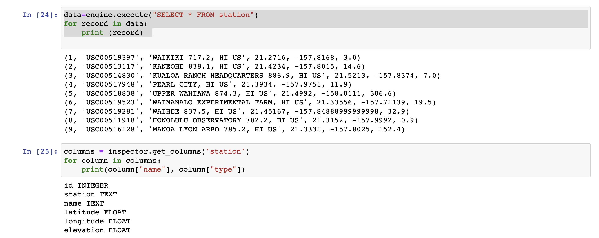

Congratulations! You've decided to treat yourself to a long holiday vacation in Honolulu, Hawaii! To help with your trip planning, you need to do some climate analysis on the area. 

## Step 1 - Climate Analysis and Exploration

To begin, use Python and SQLAlchemy to do basic climate analysis and data exploration of hawaii climate database. All of the following analysis should be completed using SQLAlchemy ORM queries, Pandas, and Matplotlib.

* Use SQLAlchemy `create_engine` to connect to the sqlite database.

* Print out the record and columns information in measurement database

* Print out the record and columns information in station database

* Use SQLAlchemy `automap_base()` to reflect your tables into classes and save a reference to those classes called `Station` and `Measurement`. Link Python to the database by creating an SQLAlchemy session.

### Precipitation Analysis

### Station Analysis

* Design a query to calculate the total number of stations in the dataset.

* Design a query to find the most active stations (i.e. which stations have the most rows?).

  * List the stations and observation counts in descending order.

  * Which station id has the highest number of observations?

  

  * Using the most active station id, calculate the lowest, highest, and average temperature.
  * Hint: You will need to use a function such as `func.min`, `func.max`, `func.avg`, and `func.count` in your queries.
  * Design a query to retrieve the last 12 months of temperature observation data (TOBS).

  * Filter by the station with the highest number of observations.

  * Query the last 12 months of temperature observation data for this station.

  * Plot the results as a histogram with `bins=12`.
  

## Step 2 - Climate App
Design a Flask API based on the queries that you have just developed.

* Use Flask to create your routes.

### Routes

* `/`

  * Home page.

  * List all routes that are available.

    
    

* `/api/v1.0/precipitation`

  * Convert the query results to a dictionary using `date` as the key and `prcp` as the value.
 
  * Return the JSON representation of your dictionary.
 

* `/api/v1.0/stations`

 
  * Return a JSON list of stations from the dataset.

  

* `/api/v1.0/tobs`
  * Query the dates and temperature observations of the most active station for the last year of data.
 

  * Return a JSON list of temperature observations (TOBS) for the previous year.
 

* `/api/v1.0/<start>` and `/api/v1.0/<start>/<end>`

  * Return a JSON list of the minimum temperature, the average temperature, and the max temperature for a given start or start-end range.

  * When given the start only, calculate `TMIN`, `TAVG`, and `TMAX` for all dates greater than and equal to the start date.

  * When given the start and the end date, calculate the `TMIN`, `TAVG`, and `TMAX` for dates between the start and end date inclusive.

## References

Menne, M.J., I. Durre, R.S. Vose, B.E. Gleason, and T.G. Houston, 2012: An overview of the Global Historical Climatology Network-Daily Database. Journal of Atmospheric and Oceanic Technology, 29, 897-910, [https://doi.org/10.1175/JTECH-D-11-00103.1](https://doi.org/10.1175/JTECH-D-11-00103.1)

- - -

© 2021 Trilogy Education Services, LLC, a 2U, Inc. brand. Confidential and Proprietary. All Rights Reserved.
